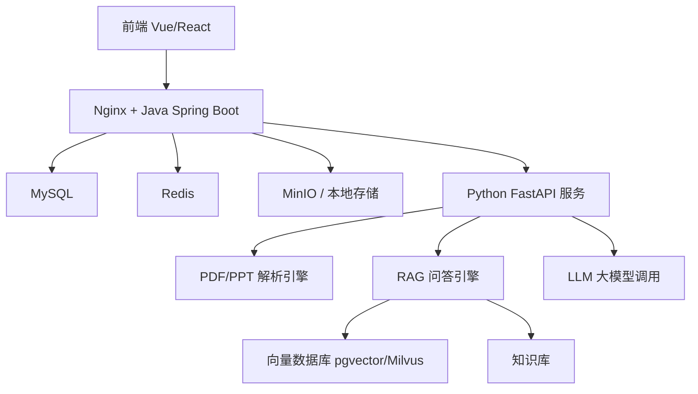

# 基于泛雅平台的 AI 互动智课生成与实时问答系统

> 第十七届中国大学生服务外包创新创业大赛 A12 赛题作品

## 📖 项目简介

本项目面向高校通识课自主学习场景，基于超星泛雅平台（Web/移动端）轻量化集成，利用大模型、语音识别、自然语言处理等 AI 技术，构建了一套完整的 **AI 互动智课生成与实时问答系统**。系统实现了从课件解析、结构化讲稿生成、智能讲授到实时交互答疑、进度智能续接的全流程闭环，旨在解决传统课件“讲授模式固化、互动反馈缺失、个性化答疑不足”等问题，减轻教师备课负担，满足学生个性化学习需求。

**核心价值**  
- 教师上传 PPT/PDF 课件，系统自动解析并生成结构化讲稿，支持语音或数字人讲授。  
- 学生在学习过程中可随时通过文字或语音打断提问，AI 结合课件上下文精准解答。  
- 问答结束后自动定位原讲授节点，并根据学生理解情况智能调整后续讲授节奏。

---

## 🎯 核心功能

### 1️⃣ 智课生成模块
- **课件解析**：支持 PPTX/PDF 上传，自动提取文本、图片、公式等内容，识别知识点结构。  
- **结构化讲稿生成**：基于大模型生成包含开场白、逐页讲解、过渡语、总结的结构化讲授脚本。  
- **教师编辑**：提供可视化界面，支持教师对生成的讲稿进行修改、润色和保存。  
- **语音合成**：对接 TTS 服务，将讲稿文本转换为自然语音，支持速度、音色调节。

### 2️⃣ 实时问答交互模块
- **多模态提问**：学生可通过文字输入或语音输入（ASR）进行提问。  
- **上下文感知**：系统自动关联当前讲授节点、历史问答及课件全文，构建 RAG 检索增强，保证答案的精准性和相关性。  
- **多轮对话**：支持连续追问，模型能记忆对话上下文并持续提供解答。  
- **答案溯源**：回答内容附带课件片段引用，避免幻觉，增强可信度。

### 3️⃣ 进度续接与节奏调整模块
- **节点标记**：每个讲授片段标记唯一 `node_id`，打断时自动保存 `resume_token`。  
- **精准恢复**：问答结束后，系统自动定位原节点并继续讲授，支持中途离开后恢复学习。  
- **理解度分析**：通过 NLP 分析学生提问及回答内容，判断理解程度，动态调整后续讲授速度或补充讲解。

### 4️⃣ 系统集成与可视化
- **Web 端界面**：适配泛雅平台样式，提供课程播放器、讲稿预览、问答面板。  
- **进度可视化**：展示课程学习进度、知识点掌握情况，帮助学生了解学习状态。  
- **API 接口**：提供标准 RESTful 接口，方便与泛雅平台及第三方系统集成。

---

## 🧱 技术架构



| 模块               | 技术选型                                     |
| ------------------ | -------------------------------------------- |
| 后端核心           | Java 11 / Spring Boot 2.7                    |
| 数据存储           | MySQL 8.0 + Redis 7.0 + MinIO                |
| 向量检索           | PostgreSQL + pgvector / Milvus               |
| AI 服务            | Python 3.9 / FastAPI                         |
| 大模型             | 文心大模型 / 通义千问 / 本地 Llama（可配置）   |
| 语音处理           | 百度语音 / Azure TTS + ASR                   |
| 前端               | Vue 3 + Vite + Pinia + Axios + Vant（移动端） |
| 部署               | Docker + Docker Compose                      |

---

## 🚀 快速开始

### 环境要求
- Docker & Docker Compose（推荐）
- 或 Java 11+、Python 3.9+、Node.js 16+、MySQL 8.0、Redis 7.0

### 1. 克隆项目
```bash
git clone https://github.com/your-team/ai-interactive-lecture.git
cd ai-interactive-lecture
```

### 2. 配置环境变量
复制 `.env.example` 为 `.env`，根据实际情况修改：
```bash
cp .env.example .env
# 编辑 .env 文件，填写数据库、Redis、MinIO、大模型 API 等配置
```

### 3. 启动依赖服务（Docker）
```bash
docker-compose up -d mysql redis minio
```

### 4. 启动 Java 后端
```bash
cd backend-java
mvn clean package
java -jar target/courseware-0.0.1-SNAPSHOT.jar
```

### 5. 启动 Python AI 服务
```bash
cd python-service
pip install -r requirements.txt
uvicorn app.main:app --reload --host 0.0.0.0 --port 8001
```

### 6. 启动前端
```bash
cd frontend
npm install
npm run dev
```

访问 `http://localhost:5173` 即可体验系统。

---

## 📁 项目结构

```
.
├── backend-java               # Java 后端（Spring Boot）
│   ├── src/main/java/...      # 业务代码
│   ├── src/main/resources/    # 配置文件
│   └── pom.xml
├── python-service             # Python AI 服务（FastAPI）
│   ├── app/
│   │   ├── api/               # 路由层
│   │   ├── services/          # 业务逻辑（解析、RAG、TTS）
│   │   ├── models/            # Pydantic 模型
│   │   └── config.py          # 配置
│   ├── requirements.txt
│   └── Dockerfile
├── frontend                   # 前端（Vue 3 + Vant）
│   ├── src/
│   ├── public/
│   └── package.json
├── docker-compose.yml         # 一键部署所有服务
├── .env.example               # 环境变量示例
└── README.md                  # 本文件
```

---

## 🔌 API 接口（部分）

所有接口遵循 RESTful 规范，统一前缀 `/api/v1`，响应格式见 [规约.md](规约.md)。

| 接口                     | 方法 | 说明                         |
| ------------------------ | ---- | ---------------------------- |
| `/courseware/upload`     | POST | 上传课件文件                 |
| `/courseware/{id}/parse` | POST | 触发课件解析                 |
| `/script/generate`       | POST | 生成讲稿                     |
| `/script/{id}`           | PUT  | 教师编辑讲稿                 |
| `/lecture/start`         | POST | 开始讲课，返回会话及第一页   |
| `/lecture/pause`         | POST | 暂停讲课                     |
| `/lecture/resume`        | POST | 恢复讲课（支持 resume_token）|
| `/qa/ask-text`           | POST | 文本问答                     |
| `/qa/ask-voice`          | POST | 语音问答                     |
| `/progress/{sessionId}`  | GET  | 获取学习进度                 |

详细接口文档见 `docs/API.md` 或启动后访问：
- Java 后端 Swagger：`http://localhost:8080/swagger-ui.html`
- Python 服务 Swagger：`http://localhost:8001/docs`

---

## ⚙️ 性能指标

| 指标                         | 目标值               |
| ---------------------------- | -------------------- |
| 课件解析响应时间             | ≤ 2 分钟 / 份        |
| 问答响应时间                 | ≤ 5 秒               |
| 知识点识别准确率             | ≥ 80%                |
| 答案准确率                   | ≥ 85%                |
| 并发支持                     | ≥ 10 人              |
| 移动端兼容                   | iOS / Android 主流机型 |

---

## 🧪 测试数据集

- 课件样本集：100 份高校课程 PPT/PDF（文、理、工、医）
- 问答测试集：3000 条知识点关联问答对（由超星集团提供）

---

## 👥 团队分工


---

## 📜 许可证

本项目仅用于课程项目，未经授权不得用于商业用途。

---

## 🙏 致谢

- 感谢超星集团提供的泛雅平台数据支持与 API 规范指导。
- 感谢百度飞桨、文心大模型等开源社区的技术支持。
- 感谢所有指导老师和团队成员的努力付出。

---

## 📧 联系我们

如有任何问题或建议，欢迎通过以下方式联系：

- 项目仓库：[https://github.com/zdlovepro/Interactive-Edu-Agent](https://github.com/zdlovepro/Interactive-Edu-Agent)
- 团队邮箱：zd205428@outlook.com

---

**让每一份课件都能“开口说话”，让每一次提问都能得到精准回应。**